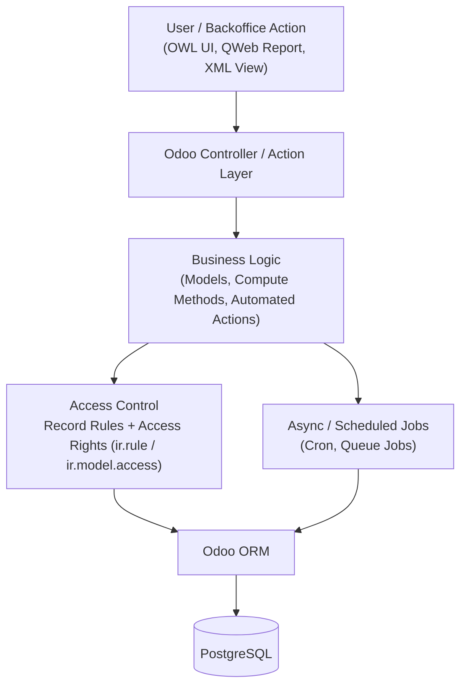

<!--
  README.md — GitHub Profile
  Owner: Sharat Acharja Mugdho (github.com/Sharatpsd)

  CHANGE LOG (v2 — Enterprise/Odoo positioning):
    - Repositioned "About" around Backend Engineer -> Enterprise/ERP Systems Engineer evolution
    - Added "Current Focus" section (Odoo, business process automation)
    - Added Enterprise/Odoo Tech Stack row (ORM, XML views, OWL, QWeb, Record Rules, Access Rights)
    - Added Mermaid architecture diagram (Odoo layered architecture)
    - Restructured Experience as a table with a clear progression story
    - Added Roadmap section (forward signal for reviewers)
    - Swapped decorative snake-only analytics for a stats + top-languages pairing
    - Kept: all 3 projects, research paper, certificate, Django/DRF identity, AI/ML work, visual style

  ACTION NEEDED BEFORE PUBLISHING:
    - Search/replace every <!-- TODO --> marker below with your confirmed job title, employer,
      and dates for the current MIS/ERP role. I did not invent these — you know them, I don't.
    - Confirm Odoo version(s) you work with (e.g., 17/18) in the Enterprise Stack section.
    - Snake animation still requires .github/workflows/snake.yml as before — unchanged.
-->

Dhaka, Bangladesh

  

 

<!-- ============================== ABOUT ============================== -->
## About

I'm a backend-focused full-stack developer, currently evolving into an **Enterprise Software Engineer** working across Django/DRF product engineering and **Odoo ERP** systems.

My core strength is the same in both worlds: designing data models and access-controlled APIs that hold up under real business rules — whether that's a REST endpoint serving a React frontend, or a custom Odoo module enforcing record rules for a multi-department workflow.

What I bring to a team:

- **API & systems design** — REST APIs with clear contracts, JWT/RBAC-based auth, and predictable error handling
- **Enterprise data layer** — PostgreSQL schema design, Django ORM and Odoo ORM, query optimization under real usage
- **ERP & business process automation** — Odoo module development: custom addons, XML views/actions, record rules, access rights, and QWeb reporting
- **Production readiness** — Docker-based deployment, CI/CD with GitHub Actions, structured logging and error handling
- **Automation & background work** — Celery + Redis for async tasks and caching
- **AI-assisted software** — applied deep learning (ResNet50, Grad-CAM, SHAP) in published research, and a Django-based ML recommendation service in production-style projects

Every project below is deployed and live — not just committed to a repo.

 

<!-- ============================== CURRENT FOCUS ============================== -->
## 🎯 Current Focus

<!-- TODO: replace bracketed items with your confirmed current role/employer details -->

<table width="100%">
<tr><td>

- 🏢 Working on **MIS / ERP systems with Odoo** <!-- TODO: add employer/title if you want it named here -->, applying backend engineering discipline to enterprise business logic
- 🔧 Building custom Odoo addons — models, views, actions, and workflow automation
- 🔐 Implementing **Record Rules** and **Access Rights** for multi-role enterprise access control
- 🗄️ PostgreSQL performance tuning for reporting-heavy, high-record-volume ERP workloads
- 📈 Bridging Django/DRF API design patterns with Odoo's ORM and OWL/QWeb frontend layer

</td></tr>
</table>

 

<!-- ============================== TECH STACK ============================== -->
## Tech Stack

<table width="100%">
<tr>
<td valign="top" width="25%">

**Languages**
 

**Backend**
 

</td>
<td valign="top" width="25%">

**Enterprise / ERP**
 

**Frontend**
 

</td>
<td valign="top" width="25%">

**Database**
 

**AI / ML**
 

</td>
<td valign="top" width="25%">

**Cloud & DevOps**
 

**Testing & Tools**
 

</td>
</tr>
</table>

 

<!-- ============================== ARCHITECTURE ============================== -->
## 🏗️ How I Think About Enterprise Systems

A simplified view of how a request flows through a typical Odoo module I build — same layered discipline I apply on the Django/DRF side.

**Why this matters:** enterprise software fails at the access-control and data-integrity layer, not the UI layer. I design record rules and access rights *before* building the view — the same way I design JWT/RBAC permissions before writing a Django view.

 

<!-- ============================== PROJECTS ============================== -->

## 🚀 Featured Projects

<table>

<tr>
<td width="33%" valign="top">

### 🍔 Bite — Food Delivery Platform

Production-ready food delivery platform supporting customers, vendors, and administrators with secure authentication, role-based access control, payment integration, and scalable REST APIs.

**Tech Stack**

`Django` `DRF` `React` `PostgreSQL` `JWT` `Tailwind CSS`

**Highlights**
- Multi-role authentication (Customer, Vendor & Admin)
- Secure JWT Authentication & RBAC
- Cart, Checkout & Order Management
- Production-ready REST APIs

 

</td>

<td width="33%" valign="top">

### 🥛 Daily Dairy Shop

Modern e-commerce backend featuring authentication, products, shopping cart, order processing, Docker deployment, Cloudinary integration, and automated CI/CD.

**Tech Stack**

`Django` `PostgreSQL` `Docker` `Cloudinary` `GitHub Actions`

**Highlights**
- Product & Inventory Management
- Shopping Cart & Orders
- Dockerized Deployment
- CI/CD Automation

 

</td>

<td width="33%" valign="top">

### ☕ Chai Order System

Modern order management system featuring Redis caching, Celery background jobs, Docker deployment, and role-based access control.

**Tech Stack**

`Django` `Redis` `Celery` `SQLite` `Docker`

**Highlights**
- Dynamic Pricing Engine
- Celery Background Tasks
- Redis Integration
- Modular Backend Architecture

 

</td>
</tr>

</table>

### 🌐 Explore More Projects

Visit my portfolio for additional projects, architecture notes, live demos, and technical details.

---

<!-- ============================== EXPERIENCE ============================== -->
## Experience

<!-- TODO: replace bracketed placeholders with confirmed employer, title, and dates -->

| Period | Role | Focus |
|---|---|---|
| **2026 – Present** | **[Your Title]**, **[Employer Name]** | MIS / ERP systems on Odoo — custom module development, ORM-based business logic, XML views & actions, record rules, access rights, and PostgreSQL-backed reporting for business process automation |
| **2025** | Backend Developer Intern, Robo Tech Valley (Dhaka) | Built and maintained REST APIs with Django REST Framework. Implemented JWT auth, refresh-token workflows, and RBAC for multi-role applications. ORM/query optimization and frontend integration. *(Certificate below)* |
| **2024** | Research — Explainable Deep Learning for Multi-Disease Ocular Classification | IEEE-published; details below |
| **2026** | B.Sc. in Computer Science & Engineering | Green University of Bangladesh — Graduated January 2026 |

 

<!-- ============================== ROADMAP ============================== -->
## 🗺️ Roadmap

- [ ] Odoo functional + technical certification
- [ ] Ship a production Odoo module (custom addon) end-to-end
- [ ] Contribute to an open-source Odoo/OCA module
- [ ] Deepen PostgreSQL performance tuning (indexing, query planning at scale)
- [ ] Publish a technical write-up on Django ↔ Odoo architectural parallels

 

<!-- ============================== RESEARCH ============================== -->
## Research & Credentials

<table width="100%">
<tr><td>

**📄 IEEE Published — Explainable Deep Learning for Multi-Disease Ocular Classification and Severity-Aware Myopia Analysis**

An end-to-end deep learning pipeline for multi-disease retinal classification, built around a ResNet50 backbone with explainability layers — Grad-CAM for visual attention mapping and SHAP for feature-level interpretability — so predictions stay auditable rather than acting as a black box.

</td></tr>
<tr><td>

**🎓 Backend Developer Intern Certificate — Robo Tech Valley**

</td></tr>
</table>

 

## 📊 GitHub Analytics

  

🐍 Contribution Snake

 

<!-- ============================== CONTACT ============================== -->
## Contact

Open to **Backend Developer**, **Django Full Stack**, and **MIS/ERP (Odoo) Software Engineer** roles in Dhaka and remote.

 

  
Dhaka, Bangladesh

