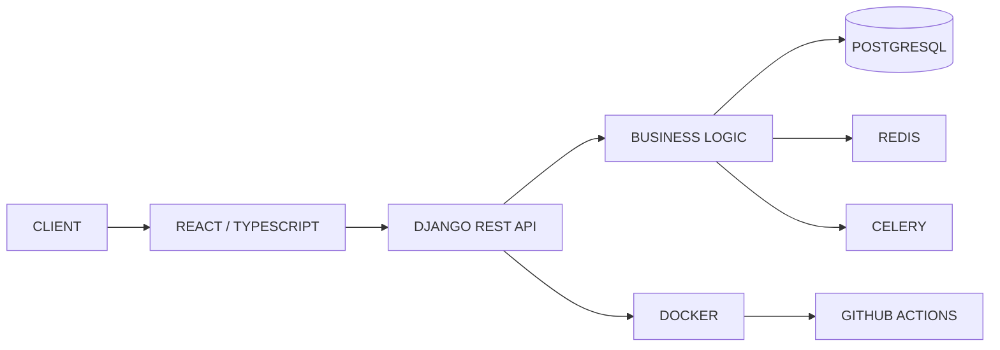
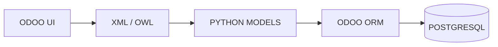
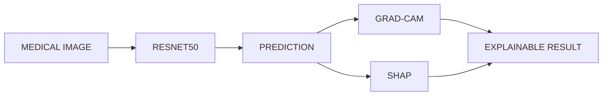

<!--
README.md — GitHub Profile
Owner: Sharat Acharja Mugdho (github.com/Sharatpsd)

2050 SYSTEM INTERFACE EDITION

GitHub compatibility rules:
- No JavaScript
- No custom CSS
- No autoplay video
- GitHub-safe Markdown + structural HTML only
- Mermaid is used only for static architecture diagrams
- Motion is provided by external SVG services and the contribution-snake asset
- Missing project/research/architecture visuals remain explicit TODOs
-->

<div align="center">


<br>

<pre>
SYSTEM://ENGINEERING_PROFILE
STATUS   : ONLINE
IDENTITY : SHARAT ACHARJA MUGDHO
ROLE     : BACKEND ENGINEER
LOCATION : DHAKA / BANGLADESH
</pre>

# SHARAT ACHARJA MUGDHO

### Backend Engineering · Enterprise ERP · REST APIs · Production Systems


<br>

<code>DJANGO</code>
&nbsp;·&nbsp;
<code>ODOO 19</code>
&nbsp;·&nbsp;
<code>POSTGRESQL</code>
&nbsp;·&nbsp;
<code>PYTHON</code>
&nbsp;·&nbsp;
<code>REST APIs</code>
&nbsp;·&nbsp;
<code>ENTERPRISE SYSTEMS</code>

<br><br>

<a href="https://sharatpsd.netlify.app/"><b>PORTFOLIO</b></a>
&nbsp;&nbsp;·&nbsp;&nbsp;
<a href="https://github.com/Sharatpsd"><b>GITHUB</b></a>
&nbsp;&nbsp;·&nbsp;&nbsp;
<a href="https://linkedin.com/in/sharat-acharjya"><b>LINKEDIN</b></a>
&nbsp;&nbsp;·&nbsp;&nbsp;
<a href="mailto:sharatacharjee6@gmail.com"><b>EMAIL</b></a>

<br><br>

<sub>
<a href="#live-system">01 LIVE SYSTEM</a> ·
<a href="#currently-building">02 BUILDING</a> ·
<a href="#engineering-stack">03 STACK</a> ·
<a href="#system-architecture">04 ARCHITECTURE</a> ·
<a href="#project-matrix">05 PROJECTS</a> ·
<a href="#experience-timeline">06 EXPERIENCE</a> ·
<a href="#research-lab">07 RESEARCH</a> ·
<a href="#system-activity">09 ACTIVITY</a>
</sub>

<br><br>


</div>

<br>

<a id="live-system"></a>

## `01 // LIVE SYSTEM`

<table width="100%">
<tr>
<td width="38%" valign="top">

<h3>ENGINEERING STATUS</h3>

<pre>
● SYSTEMS      ONLINE
● ERP          ODOO 19
● BACKEND      DJANGO
● DATABASE     POSTGRESQL
● ENVIRONMENT  LINUX
</pre>

</td>
<td width="62%" valign="top">

<h3>OPERATING CONTEXT</h3>

I build backend systems intended for real production use: Django and DRF services with clear API contracts, JWT/RBAC authentication, PostgreSQL-backed business logic, and Redis/Celery where asynchronous processing or caching is needed.

My current enterprise work is at <b>Betopia Group</b>, where I develop and customize <b>Odoo 19</b> modules for live business workflows.

</td>
</tr>
</table>

<br>

<div align="center">
<sub>INPUT → BUSINESS RULES → DATA → AUTOMATION → DELIVERY</sub>
</div>

<br>

<a id="currently-building"></a>

## `02 // CURRENTLY BUILDING`

> **BETOPIA GROUP / ENTERPRISE ERP CONTROL PANEL**

<table width="100%">
<tr>
<td width="33%" valign="top">

<b>CORE ENGINE</b><br>
<code>● ACTIVE</code>

<br><br>

Odoo 19 ERP<br>
Python<br>
Odoo ORM

</td>
<td width="33%" valign="top">

<b>INTERFACE LAYER</b><br>
<code>● ACTIVE</code>

<br><br>

XML Views<br>
OWL<br>
Actions &amp; Menus

</td>
<td width="34%" valign="top">

<b>CONTROL LAYER</b><br>
<code>● ACTIVE</code>

<br><br>

Workflow customization<br>
Access Rights<br>
Record Rules

</td>
</tr>
<tr>
<td valign="top">

<b>DATA LAYER</b><br><br>
PostgreSQL<br>
Database operations

</td>
<td valign="top">

<b>AUTOMATION</b><br><br>
ERP automation<br>
Business process logic

</td>
<td valign="top">

<b>OPERATIONS</b><br><br>
Linux<br>
Git<br>
Production debugging

</td>
</tr>
</table>

<br>

<a id="engineering-stack"></a>

## `03 // ENGINEERING STACK`

### SYSTEM PATH

```text
┌────────────────┐
│    FRONTEND    │  React · TypeScript · JavaScript
└───────┬────────┘
        │
        ▼
┌────────────────┐
│   API LAYER    │  Django REST Framework · REST APIs
└───────┬────────┘
        │
        ▼
┌────────────────┐
│ BUSINESS CORE  │  Python · Django · Odoo
└───────┬────────┘
        │
        ▼
┌────────────────┐
│    DATABASE    │  PostgreSQL · MySQL · SQLite
└───────┬────────┘
        │
        ▼
┌────────────────┐
│ ASYNC / CACHE  │  Redis · Celery
└───────┬────────┘
        │
        ▼
┌────────────────┐
│    DELIVERY    │  Docker · GitHub Actions · Linux
└────────────────┘
```

<table width="100%">
<tr>
<td width="50%" valign="top">

<h3>BACKEND / ENTERPRISE</h3>

<b>Backend</b><br>
Python · Django · Django REST Framework · FastAPI · Celery · JWT

<br><br>

<b>Enterprise / ERP</b><br>
Odoo 19 · Odoo ORM · XML Views · OWL · Record Rules · Access Rights

<br><br>

<b>Database</b><br>
PostgreSQL · Redis · MySQL · SQLite

</td>
<td width="50%" valign="top">

<h3>INTERFACE / DELIVERY</h3>

<b>Frontend</b><br>
React · TypeScript · JavaScript · Tailwind CSS · Vite

<br><br>

<b>DevOps &amp; Cloud</b><br>
Docker · Linux · GitHub Actions · Render · Vercel · Netlify · Cloudinary

<br><br>

<b>Tools &amp; AI/ML</b><br>
Git · VS Code · Postman · Swagger · PyTorch · scikit-learn · Pandas

</td>
</tr>
</table>

<br>

<a id="system-architecture"></a>

## `04 // SYSTEM ARCHITECTURE`

### BACKEND SERVICE PIPELINE


```mermaid
flowchart LR
    A[CLIENT] --> B[REACT / TYPESCRIPT]
    B --> C[DJANGO REST API]
    C --> D[BUSINESS LOGIC]
    D --> E[(POSTGRESQL)]
    D --> F[REDIS]
    D --> G[CELERY]
    C --> H[DOCKER]
    H --> I[GITHUB ACTIONS]
```

### ENTERPRISE ERP PIPELINE


```mermaid
flowchart LR
    A[ODOO UI] --> B[XML / OWL]
    B --> C[PYTHON MODELS]
    C --> D[ODOO ORM]
    D --> E[(POSTGRESQL)]
```

> **Architecture note:** Mermaid is intentionally static. GitHub profile READMEs do not execute JavaScript. A real animated SVG/GIF can later replace or accompany these diagrams without breaking the static fallback.

<!-- TODO: ADD REAL ASSET
Optional animation assets:
assets/architecture/backend-flow.svg
assets/architecture/erp-flow.svg

Recommended canvas: 1600x700.
Keep the Mermaid diagrams until the real assets exist.
-->

<br>

<a id="project-matrix"></a>

## `05 // PROJECT MATRIX`

### PROJECT_01 — BITE / FOOD DELIVERY PLATFORM

<table width="100%">
<tr>
<td width="40%" valign="top">

<!-- TODO: ADD REAL ASSET

Recommended real screenshot: 1200x630 WebP or PNG.
-->

<pre>
SYSTEM TYPE
Food Delivery Platform

STACK
Django / DRF / React
PostgreSQL / JWT
Tailwind CSS

STATE
PRODUCTION DEPLOYED
</pre>

</td>
<td width="60%" valign="top">

<b>PROBLEM</b><br>
Support customers, vendors, and administrators inside one ordering platform.

<br><br>

<b>ARCHITECTURE</b><br>
React client → DRF API → authenticated business logic → PostgreSQL.

<br><br>

<b>IMPLEMENTATION</b><br>
A multi-role ordering workflow with authenticated checkout, JWT-secured REST APIs, and role-based access control.

<br><br>

<b>ENGINEERING FEATURES</b>

<ul>
<li>Multi-role authentication: Customer, Vendor, Admin</li>
<li>JWT authentication with RBAC</li>
<li>Cart, checkout, and order management</li>
<li>Production-ready REST API layer</li>
</ul>

<b>ACCESS</b><br>
<a href="https://github.com/Sharatpsd/Food-Delivery-App-">GitHub Repository</a>
&nbsp;·&nbsp;
<a href="https://bite-bd.onrender.com/">Live Demo</a>

</td>
</tr>
</table>

---

### PROJECT_02 — DAILY DAIRY SHOP

<table width="100%">
<tr>
<td width="40%" valign="top">

<!-- TODO: ADD REAL ASSET

Recommended real screenshot: 1200x630 WebP or PNG.
-->

<pre>
SYSTEM TYPE
E-Commerce Backend

STACK
Django / PostgreSQL
Docker / Cloudinary
GitHub Actions

STATE
DEPLOYED
</pre>

</td>
<td width="60%" valign="top">

<b>PROBLEM</b><br>
Handle authentication, products, inventory, cart operations, and orders in a deployable commerce system.

<br><br>

<b>ARCHITECTURE</b><br>
Django application → PostgreSQL data layer → Cloudinary media → Docker delivery workflow.

<br><br>

<b>IMPLEMENTATION</b><br>
Dockerized backend with Cloudinary-backed media storage and GitHub Actions automation.

<br><br>

<b>ENGINEERING FEATURES</b>

<ul>
<li>Product and inventory management</li>
<li>Shopping cart and order processing</li>
<li>Dockerized deployment pipeline</li>
<li>CI/CD with GitHub Actions</li>
</ul>

<b>ACCESS</b><br>
<a href="https://github.com/Sharatpsd/DailyDairyShop">GitHub Repository</a>
&nbsp;·&nbsp;
<a href="https://dailydairyshop-3.onrender.com/">Live Demo</a>

</td>
</tr>
</table>

---

### PROJECT_03 — CHAI ORDER SYSTEM

<table width="100%">
<tr>
<td width="40%" valign="top">

<!-- TODO: ADD REAL ASSET

Recommended real screenshot: 1200x630 WebP or PNG.
-->

<pre>
SYSTEM TYPE
Order Management System

STACK
Django / Redis / Celery
SQLite / Docker

STATE
DEPLOYED
</pre>

</td>
<td width="60%" valign="top">

<b>PROBLEM</b><br>
Move slower work out of the request path while supporting pricing and role-aware order operations.

<br><br>

<b>ARCHITECTURE</b><br>
Django request layer → business logic → Redis/Celery background processing → SQLite persistence.

<br><br>

<b>IMPLEMENTATION</b><br>
Modular backend using Celery for background task processing and Redis for caching.

<br><br>

<b>ENGINEERING FEATURES</b>

<ul>
<li>Dynamic pricing engine</li>
<li>Celery background processing</li>
<li>Redis caching integration</li>
<li>Modular backend architecture</li>
</ul>

<b>ACCESS</b><br>
<a href="https://github.com/Sharatpsd/chai-order-system">GitHub Repository</a>
&nbsp;·&nbsp;
<a href="https://chai-order-system-5.onrender.com/">Live Demo</a>

</td>
</tr>
</table>

<div align="center">
<sub>More projects, architecture notes, and live demos: <a href="https://sharatpsd.netlify.app/">sharatpsd.netlify.app</a></sub>
</div>

<br>

<a id="experience-timeline"></a>

## `06 // EXPERIENCE TIMELINE`

```text
2026 ───────────────────────────────────────────────────────► PRESENT
       TRAINEE EXECUTIVE — MIS & ERP
       BETOPIA GROUP · DHAKA
       JULY 15, 2026 – PRESENT

       Odoo 19 module development and customization
       Python / Odoo ORM / XML views
       Business workflow customization
       Access rights / record rules
       Actions / menu configuration
       PostgreSQL operations
       Linux + Git production debugging


2025 ───────────────────────────────────────────────────────►
       BACKEND DEVELOPER INTERN
       ROBO TECH VALLEY · DHAKA

       Django REST Framework APIs
       JWT + refresh-token workflows
       RBAC for multi-role applications
       ORM / query optimization
       Frontend API integration


2026 ───────────────────────────────────────────────────────►
       B.SC. IN COMPUTER SCIENCE & ENGINEERING
       GREEN UNIVERSITY OF BANGLADESH
       GRADUATED JANUARY 2026
```

<br>

<a id="research-lab"></a>

## `07 // RESEARCH LAB`

### Explainable Deep Learning for Multi-Disease Ocular Classification and Severity-Aware Myopia Analysis

**IEEE Published Research**


```mermaid
flowchart LR
    A[MEDICAL IMAGE] --> B[RESNET50]
    B --> C[PREDICTION]
    C --> D[GRAD-CAM]
    C --> E[SHAP]
    D --> F[EXPLAINABLE RESULT]
    E --> F
```

<table width="100%">
<tr>
<td width="25%" align="center"><b>MODEL</b><br><sub>ResNet50</sub></td>
<td width="25%" align="center"><b>VISUAL XAI</b><br><sub>Grad-CAM</sub></td>
<td width="25%" align="center"><b>INTERPRETABILITY</b><br><sub>SHAP</sub></td>
<td width="25%" align="center"><b>DOMAIN</b><br><sub>Ocular Classification</sub></td>
</tr>
</table>

The research builds an end-to-end deep learning pipeline for multi-disease retinal classification, with explainability layers so predictions can be inspected instead of treated purely as a black box.

<a href="https://drive.google.com/file/d/1XVzO6kOMtIVtVqfTo52M3sQzBVn16Mk2/view"><b>READ THE PAPER</b></a>

<br>

### CREDENTIAL NODE

**Backend Developer Intern Certificate — Robo Tech Valley**

<a href="https://drive.google.com/file/d/1Jw82jFGXPvliJHYxBPOUh6oIlpm-j8mE/view"><b>VIEW CERTIFICATE</b></a>

<!-- TODO: ADD REAL ASSET
Optional research visual:
assets/research/ocular-xai-pipeline-1600x900.webp
Use a real figure from your research or a diagram you create from your actual pipeline.
-->

<br>

<a id="engineering-philosophy"></a>

## `08 // ENGINEERING PHILOSOPHY`

<table width="100%">
<tr>
<td width="50%" valign="top">

<pre>
[01] API-FIRST DESIGN
     Clear contracts before complexity

[02] JWT / RBAC
     Authentication and authorization
     treated as system architecture

[03] DATABASE-AWARE DEVELOPMENT
     Design around real access patterns

[04] QUERY OPTIMIZATION
     Measure the path data actually takes

[05] BACKGROUND PROCESSING
     Move slow work off critical paths
</pre>

</td>
<td width="50%" valign="top">

<pre>
[06] MODULAR ARCHITECTURE
     Strong separation of concerns

[07] PRODUCTION DEBUGGING
     Evidence over guesswork

[08] CI/CD
     Delivery is part of engineering

[09] MAINTAINABILITY
     A system must remain understandable

[10] AUDITABILITY
     Avoid invisible black-box behavior
</pre>

</td>
</tr>
</table>

<br>

<a id="system-activity"></a>

## `09 // SYSTEM ACTIVITY`

<div align="center">


<br>


</div>

> The contribution snake requires a workflow that publishes `github-contribution-grid-snake-dark.svg` to the `output` branch. Keep this image only after that workflow is active.

<br>

<a id="next-systems"></a>

## `10 // NEXT SYSTEMS TO MASTER`

```text
QUEUE://ACTIVE_LEARNING

[>] FastAPI
[>] Advanced PostgreSQL
[>] Redis patterns
[>] Celery at scale
[>] System Design
[>] Cloud / DevOps
[>] Odoo OWL framework
```

<sub>No fabricated percentages. These are active learning areas, not claimed mastery.</sub>

<br>

<a id="beyond-code"></a>

## `11 // BEYOND CODE`

<div align="center">

<code>PHOTOGRAPHY</code>
&nbsp;·&nbsp;
<code>TRAVEL</code>
&nbsp;·&nbsp;
<code>FOOTBALL / REAL MADRID</code>

<br><br>

<sub>A small part of the interface. Engineering stays the main signal.</sub>

</div>

<br>

<a id="connect"></a>

## `12 // CONNECT`

<div align="center">


<br>

### READY TO BUILD SOMETHING USEFUL?

Backend systems. Enterprise software. APIs. Production engineering.

<br>

<a href="https://sharatpsd.netlify.app/"><b>PORTFOLIO</b></a>
&nbsp;&nbsp;·&nbsp;&nbsp;
<a href="https://github.com/Sharatpsd"><b>GITHUB</b></a>
&nbsp;&nbsp;·&nbsp;&nbsp;
<a href="https://linkedin.com/in/sharat-acharjya"><b>LINKEDIN</b></a>
&nbsp;&nbsp;·&nbsp;&nbsp;
<a href="mailto:sharatacharjee6@gmail.com"><b>EMAIL</b></a>
&nbsp;&nbsp;·&nbsp;&nbsp;
<a href="https://wa.me/8801783720914"><b>WHATSAPP</b></a>

<br><br>

<sub>Dhaka, Bangladesh</sub>

<br><br>


<br>


</div>
