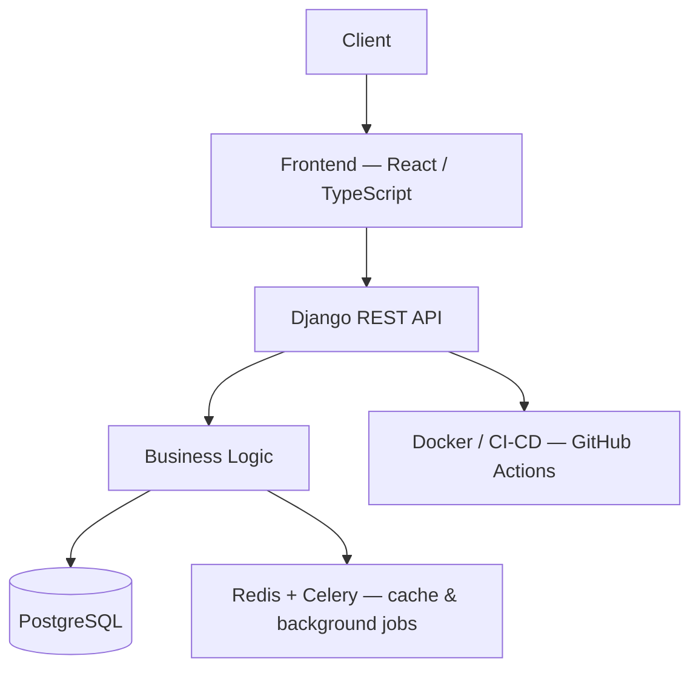
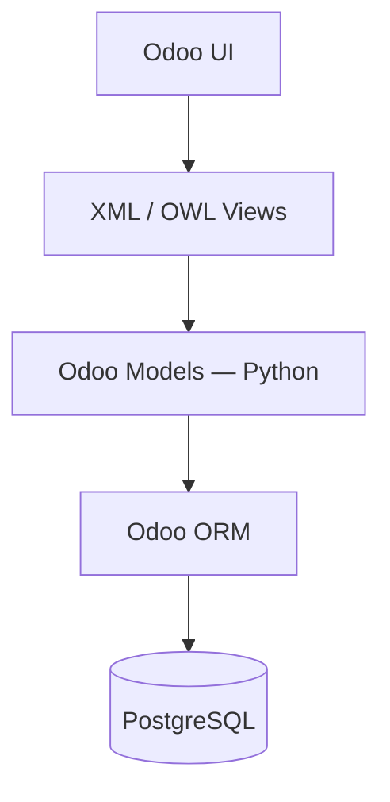

<!--
  README.md — GitHub Profile
  Owner: Sharat Acharja Mugdho (github.com/Sharatpsd)

  Notes:
    - Repo must be named exactly "Sharatpsd" (same as username) to render as the profile README.
    - Snake animation requires the companion workflow file:
        .github/workflows/snake.yml
      It needs one push / manual Action run before the SVG exists.
    - Project screenshots are intentionally NOT included yet. Search for
      "ADD SCREENSHOT" comments below to find the exact spots to drop real images
      (recommended: 1200x630 PNG/WebP, committed to an /assets folder in this repo).

  REDESIGN NOTE (2026):
    - Restructured into: Hero → Currently Building → Engineering Snapshot → About →
      Tech Stack → Architecture → Featured Projects → Experience → Research →
      Engineering Principles → GitHub Activity → Exploring Next → Beyond Code → Contact.
    - Badge count reduced sharply; tech stack is now text-based and grouped.
    - All original links, projects, experience, research, and credentials preserved.
-->

<!-- ============================== HERO ============================== -->

  

# Sharat Acharja Mugdho

**Backend Engineer • Django • Odoo • PostgreSQL**

Building production-oriented backend systems, REST APIs and enterprise ERP solutions.

 

 

Dhaka, Bangladesh

  

 

<!-- ============================== CURRENTLY BUILDING ============================== -->

## ⚡ Currently Building

Enterprise ERP work at **Betopia Group** — customizing Odoo 19 for real business workflows.

<table width="100%">
<tr>
<td align="center" width="33%"><strong>Odoo 19 ERP</strong> Custom module development</td>
<td align="center" width="33%"><strong>Workflow Customization</strong> Enterprise business processes</td>
<td align="center" width="33%"><strong>Python Backend</strong> Odoo ORM &amp; server logic</td>
</tr>
<tr>
<td align="center"><strong>PostgreSQL</strong> Database operations</td>
<td align="center"><strong>ERP Automation</strong> Actions, menus &amp; rules</td>
<td align="center"><strong>Process Optimization</strong> Access rights &amp; record rules</td>
</tr>
</table>

 

<!-- ============================== ENGINEERING SNAPSHOT ============================== -->

## Engineering Snapshot

<table width="100%">
<tr>
<td align="center" width="16%">BACKEND <strong>Django / DRF</strong></td>
<td align="center" width="16%">ENTERPRISE <strong>Odoo 19</strong></td>
<td align="center" width="16%">DATABASE <strong>PostgreSQL</strong></td>
<td align="center" width="16%">ASYNC <strong>Redis / Celery</strong></td>
<td align="center" width="16%">DEVOPS <strong>Docker / CI-CD</strong></td>
<td align="center" width="16%">RESEARCH <strong>Explainable AI</strong></td>
</tr>
</table>

 

<!-- ============================== ABOUT ============================== -->

## About

I build backend systems that are meant to run in production, not just in a demo: Django and DRF services with clear API contracts, JWT/RBAC authentication, PostgreSQL schemas designed for real query patterns, and Celery + Redis for background work and caching. Everything ships Dockerized, with CI/CD through GitHub Actions and a Linux-first workflow — every project on this profile is deployed and live.

Currently I work as a **Trainee Executive — MIS & ERP at Betopia Group**, developing and customizing **Odoo 19** modules in a live production environment: Odoo ORM, XML views, business workflow customization, access rights and record rules. On the research side, I've published IEEE work on explainable deep learning (ResNet50, Grad-CAM, SHAP) — the engineering problems I care most about are correctness under real usage, query performance, and systems that stay auditable and maintainable as they grow.

 

<!-- ============================== TECH STACK ============================== -->

## Tech Stack

<table width="100%">
<tr>
<td valign="top" width="50%">

**Backend**
 Python · Django · Django REST Framework · FastAPI · Celery · JWT

**Enterprise / ERP**
 Odoo 19 · Odoo ORM · XML Views · OWL · Record Rules · Access Rights

**Database**
 PostgreSQL · Redis · MySQL · SQLite

</td>
<td valign="top" width="50%">

**Frontend**
 React · TypeScript · JavaScript · Tailwind CSS · Vite

**DevOps & Cloud**
 Docker · Linux · GitHub Actions · Render · Vercel · Netlify · Cloudinary

**Tools & AI/ML**
 Git · VS Code · Postman · Swagger · PyTorch · scikit-learn · Pandas

</td>
</tr>
</table>

 

<!-- ============================== ARCHITECTURE ============================== -->

## How I Build Systems

**Django backend architecture** — the shape most of my API projects follow:

```mermaid
flowchart TD
    A[Client] --> B[Frontend — React / TypeScript]
    B --> C[Django REST API]
    C --> D[Business Logic]
    D --> E[(PostgreSQL)]
    D --> F[Redis + Celery — cache & background jobs]
    C --> G[Docker / CI-CD — GitHub Actions]
```

**Odoo 19 architecture** — how enterprise customization flows at the ERP layer:

```mermaid
flowchart TD
    A[Odoo UI] --> B[XML / OWL Views]
    B --> C[Odoo Models — Python]
    C --> D[Odoo ORM]
    D --> E[(PostgreSQL)]
```

 

<!-- ============================== FEATURED PROJECTS ============================== -->

## Featured Projects

<table>
<tr>
<td width="33%" valign="top">

### Bite — Food Delivery Platform

<!-- ADD SCREENSHOT: replace this comment with

Recommended: 1200x630 real screenshot of the live app. -->

Production-deployed food delivery platform for customers, vendors, and administrators. Implemented multi-role ordering workflow with authenticated checkout, JWT-secured REST APIs, and role-based access control across the platform.

`Django` `DRF` `React` `PostgreSQL` `JWT` `Tailwind CSS`

- Multi-role authentication (Customer, Vendor, Admin)
- JWT authentication with RBAC
- Cart, checkout & order management workflow
- Production-ready REST API layer

</td>
<td width="33%" valign="top">

### Daily Dairy Shop

<!-- ADD SCREENSHOT: replace this comment with

Recommended: 1200x630 real screenshot of the live app. -->

E-commerce backend deployed as a Dockerized service with automated CI/CD. Covers authentication, product and inventory management, cart and order processing, with Cloudinary handling media storage.

`Django` `PostgreSQL` `Docker` `Cloudinary` `GitHub Actions`

- Product & inventory management
- Shopping cart & order processing
- Dockerized deployment pipeline
- CI/CD automation with GitHub Actions

</td>
<td width="33%" valign="top">

### Chai Order System

<!-- ADD SCREENSHOT: replace this comment with

Recommended: 1200x630 real screenshot of the live app. -->

Order management system built around asynchronous processing: Celery background jobs with Redis for caching, a dynamic pricing engine, and role-based access control — packaged in a modular, Dockerized backend.

`Django` `Redis` `Celery` `SQLite` `Docker`

- Dynamic pricing engine
- Celery background task processing
- Redis caching integration
- Modular backend architecture

</td>
</tr>
</table>

More projects, architecture notes and live demos on the <a href="https://sharatpsd.netlify.app/">portfolio</a>.

 

<!-- ============================== EXPERIENCE ============================== -->

## Experience

**Trainee Executive — MIS & ERP** · Betopia Group, Dhaka
 July 15, 2026 – Present

Developing and customizing Odoo 19 ERP modules in production. Backend development in Python with the Odoo ORM and XML views; business workflow customization; access rights and record rules; actions and menu configuration; PostgreSQL database operations and bug fixing in a Linux + Git environment.

---

**Backend Developer Intern** · Robo Tech Valley, Dhaka
 2025

Built and maintained REST APIs with Django REST Framework. Implemented JWT auth, refresh-token workflows, and RBAC for multi-role applications. Worked on ORM/query optimization and collaborated with frontend developers on API integration. → Certificate under Research & Credentials below.

---

**B.Sc. in Computer Science & Engineering** · Green University of Bangladesh
 Graduated January 2026

 

<!-- ============================== RESEARCH ============================== -->

## Research & Credentials

<table width="100%">
<tr><td>

**📄 IEEE Published — Explainable Deep Learning for Multi-Disease Ocular Classification and Severity-Aware Myopia Analysis**

An end-to-end deep learning pipeline for multi-disease retinal classification built around a **ResNet50** backbone, with explainability layers — **Grad-CAM** for visual attention mapping and **SHAP** for feature-level interpretability — so predictions stay auditable rather than acting as a black box.

</td></tr>
<tr><td>

**🎓 Backend Developer Intern Certificate — Robo Tech Valley**

</td></tr>
</table>

 

<!-- ============================== ENGINEERING PRINCIPLES ============================== -->

## 🧠 Engineering Principles

<table width="100%">
<tr>
<td valign="top" width="50%">

- API-first design with clear contracts
- Secure authentication (JWT, RBAC)
- Database-aware development
- Query optimization under real usage
- Background processing for slow work

</td>
<td valign="top" width="50%">

- Modular architecture & separation of concerns
- Production debugging over guesswork
- CI/CD as the default, not an afterthought
- Maintainability as a feature
- Auditable systems — no black boxes

</td>
</tr>
</table>

 

<!-- ============================== GITHUB ACTIVITY ============================== -->

## GitHub Activity

 

<!-- ============================== EXPLORING NEXT ============================== -->

## 🔭 Exploring Next

Areas I'm actively learning and deepening — distinct from my professional experience above:

`FastAPI` · `Advanced PostgreSQL` · `Redis patterns` · `Celery at scale` · `System Design` · `Cloud / DevOps` · `Odoo OWL framework`

 

<!-- ============================== BEYOND CODE ============================== -->

## Beyond Code

Photography · Travel · Football — Real Madrid 🤍

 

<!-- ============================== CONTACT ============================== -->

  

### Let's build something useful.

  
Dhaka, Bangladesh

