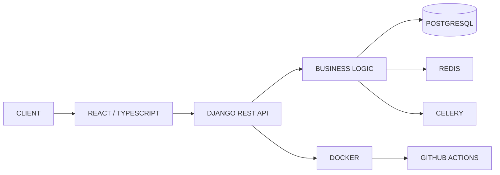
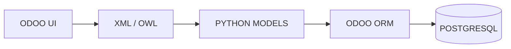
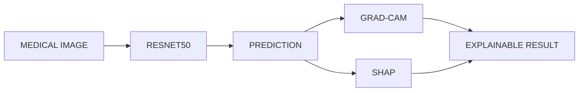

<!--
README.md — GitHub Profile
Owner: Sharat Acharja Mugdho (github.com/Sharatpsd)

2050 SYSTEM INTERFACE EDITION

GitHub compatibility rules used:
- No JavaScript
- No custom CSS
- No autoplay MP4
- HTML limited to GitHub-safe structural tags
- Mermaid used only for static architecture diagrams
- Motion provided by external SVG services + GitHub Actions snake
- Missing project visuals remain explicit TODOs
-->

<!-- =========================================================
00 / SYSTEM BOOT
========================================================= -->

<div align="center">


<br>

<pre>
SYSTEM://ENGINEERING_PROFILE
STATUS  : ONLINE
IDENTITY: SHARAT ACHARJA MUGDHO
ROLE    : BACKEND ENGINEER
NODE    : DHAKA / BANGLADESH
</pre>

# SHARAT ACHARJA MUGDHO

### Backend Engineering · Enterprise ERP · REST APIs · Production Systems


<br>

`DJANGO` · `ODOO 19` · `POSTGRESQL` · `PYTHON` · `REST APIs` · `ENTERPRISE SYSTEMS`

<br><br>

<a href="https://sharatpsd.netlify.app/"><b>PORTFOLIO</b></a>
&nbsp;&nbsp;·&nbsp;&nbsp;
<a href="https://github.com/Sharatpsd"><b>GITHUB</b></a>
&nbsp;&nbsp;·&nbsp;&nbsp;
<a href="https://linkedin.com/in/sharat-acharjya"><b>LINKEDIN</b></a>
&nbsp;&nbsp;·&nbsp;&nbsp;
<a href="mailto:sharatacharjee6@gmail.com"><b>EMAIL</b></a>

<br><br>


</div>

<br>

<!-- =========================================================
01 / LIVE SYSTEM
========================================================= -->

## `01 // LIVE SYSTEM`

<table width="100%">
<tr>
<td width="34%" valign="top">

### ENGINEERING STATUS

<pre>
● SYSTEMS      ONLINE
● ERP          ODOO 19
● BACKEND      DJANGO
● DATABASE     POSTGRESQL
● ENVIRONMENT  LINUX
</pre>

</td>
<td width="66%" valign="top">

### CURRENT OPERATING CONTEXT

I build backend systems intended for real production use: Django and DRF services with clear API contracts, JWT/RBAC authentication, PostgreSQL-backed business logic, and Redis/Celery where asynchronous processing or caching is needed.

My current enterprise work is at **Betopia Group**, where I develop and customize **Odoo 19** modules for live business workflows.

</td>
</tr>
</table>

<br>

<!-- =========================================================
02 / CURRENTLY BUILDING
========================================================= -->

## `02 // CURRENTLY BUILDING`

> **BETOPIA GROUP / ENTERPRISE ERP CONTROL PANEL**

<table width="100%">
<tr>
<td width="33%" valign="top">

**CORE ENGINE**

`● ACTIVE`

Odoo 19 ERP  
Python  
Odoo ORM

</td>
<td width="33%" valign="top">

**INTERFACE LAYER**

`● ACTIVE`

XML Views  
OWL  
Actions & Menus

</td>
<td width="34%" valign="top">

**CONTROL LAYER**

`● ACTIVE`

Workflow customization  
Access Rights  
Record Rules

</td>
</tr>
<tr>
<td valign="top">

**DATA LAYER**

PostgreSQL  
Database operations

</td>
<td valign="top">

**AUTOMATION**

ERP automation  
Business process logic

</td>
<td valign="top">

**OPERATIONS**

Linux  
Git  
Production debugging

</td>
</tr>
</table>

<br>

<!-- =========================================================
03 / ENGINEERING STACK
========================================================= -->

## `03 // ENGINEERING STACK`

### SYSTEM PATH

<div align="center">

```text
┌───────────────┐
│    FRONTEND   │  React · TypeScript · JavaScript
└───────┬───────┘
        ↓
┌───────────────┐
│   API LAYER   │  Django REST Framework · REST APIs
└───────┬───────┘
        ↓
┌───────────────┐
│ BUSINESS CORE │  Python · Django · Odoo
└───────┬───────┘
        ↓
┌───────────────┐
│   DATABASE    │  PostgreSQL · MySQL · SQLite
└───────┬───────┘
        ↓
┌───────────────┐
│ ASYNC / CACHE │  Redis · Celery
└───────┬───────┘
        ↓
┌───────────────┐
│    DELIVERY   │  Docker · GitHub Actions · Linux
└───────────────┘
```

</div>

<table width="100%">
<tr>
<td width="50%" valign="top">

### BACKEND / ENTERPRISE

**Backend**  
Python · Django · Django REST Framework · FastAPI · Celery · JWT

**Enterprise / ERP**  
Odoo 19 · Odoo ORM · XML Views · OWL · Record Rules · Access Rights

**Database**  
PostgreSQL · Redis · MySQL · SQLite

</td>
<td width="50%" valign="top">

### INTERFACE / DELIVERY

**Frontend**  
React · TypeScript · JavaScript · Tailwind CSS · Vite

**DevOps & Cloud**  
Docker · Linux · GitHub Actions · Render · Vercel · Netlify · Cloudinary

**Tools & AI/ML**  
Git · VS Code · Postman · Swagger · PyTorch · scikit-learn · Pandas

</td>
</tr>
</table>

<br>

<!-- =========================================================
04 / SYSTEM ARCHITECTURE
========================================================= -->

## `04 // SYSTEM ARCHITECTURE`

### BACKEND SERVICE PIPELINE


```mermaid
flowchart LR
    A[CLIENT] --> B[REACT / TYPESCRIPT]
    B --> C[DJANGO REST API]
    C --> D[BUSINESS LOGIC]
    D --> E[(POSTGRESQL)]
    D --> F[REDIS]
    D --> G[CELERY]
    C --> H[DOCKER]
    H --> I[GITHUB ACTIONS]
```

### ENTERPRISE ERP PIPELINE


```mermaid
flowchart LR
    A[ODOO UI] --> B[XML / OWL]
    B --> C[PYTHON MODELS]
    C --> D[ODOO ORM]
    D --> E[(POSTGRESQL)]
```

> Mermaid is intentionally static here. GitHub does not execute JavaScript inside profile READMEs.  
> For animated architecture, add a real animated SVG/GIF later at `assets/architecture/`.

<!-- TODO: ADD REAL ASSET
Recommended:
assets/architecture/backend-flow.svg
assets/architecture/erp-flow.svg
Use SVG/GIF animation only if committed as a real asset.
-->

<br>

<!-- =========================================================
05 / PROJECTS
========================================================= -->

## `05 // PROJECT MATRIX`

### PROJECT_01 — BITE / FOOD DELIVERY PLATFORM

<table width="100%">
<tr>
<td width="42%" valign="top">

<!-- TODO: ADD REAL ASSET

Recommended real screenshot: 1200x630 WebP or PNG.
-->

```text
SYSTEM TYPE
Food Delivery Platform

STACK
Django / DRF / React
PostgreSQL / JWT
Tailwind CSS

STATE
PRODUCTION DEPLOYED
```

</td>
<td width="58%" valign="top">

**PROBLEM**  
Support customers, vendors, and administrators inside one ordering platform.

**IMPLEMENTATION**  
A multi-role ordering workflow with authenticated checkout, JWT-secured REST APIs, and role-based access control.

**ENGINEERING FEATURES**

- Multi-role authentication: Customer, Vendor, Admin
- JWT authentication with RBAC
- Cart, checkout, and order management
- Production-ready REST API layer

**ACCESS**  
[GitHub Repository](https://github.com/Sharatpsd/Food-Delivery-App-) · [Live Demo](https://bite-bd.onrender.com/)

</td>
</tr>
</table>

---

### PROJECT_02 — DAILY DAIRY SHOP

<table width="100%">
<tr>
<td width="42%" valign="top">

<!-- TODO: ADD REAL ASSET

Recommended real screenshot: 1200x630 WebP or PNG.
-->

```text
SYSTEM TYPE
E-Commerce Backend

STACK
Django / PostgreSQL
Docker / Cloudinary
GitHub Actions

STATE
DEPLOYED
```

</td>
<td width="58%" valign="top">

**PROBLEM**  
Handle authentication, products, inventory, cart operations, and orders in a deployable commerce system.

**IMPLEMENTATION**  
Dockerized backend with Cloudinary-backed media storage and GitHub Actions automation.

**ENGINEERING FEATURES**

- Product and inventory management
- Shopping cart and order processing
- Dockerized deployment pipeline
- CI/CD with GitHub Actions

**ACCESS**  
[GitHub Repository](https://github.com/Sharatpsd/DailyDairyShop) · [Live Demo](https://dailydairyshop-3.onrender.com/)

</td>
</tr>
</table>

---

### PROJECT_03 — CHAI ORDER SYSTEM

<table width="100%">
<tr>
<td width="42%" valign="top">

<!-- TODO: ADD REAL ASSET

Recommended real screenshot: 1200x630 WebP or PNG.
-->

```text
SYSTEM TYPE
Order Management System

STACK
Django / Redis / Celery
SQLite / Docker

STATE
DEPLOYED
```

</td>
<td width="58%" valign="top">

**PROBLEM**  
Move slower work out of the request path while supporting pricing and role-aware order operations.

**IMPLEMENTATION**  
Modular backend using Celery for background task processing and Redis for caching.

**ENGINEERING FEATURES**

- Dynamic pricing engine
- Celery background processing
- Redis caching integration
- Modular backend architecture

**ACCESS**  
[GitHub Repository](https://github.com/Sharatpsd/chai-order-system) · [Live Demo](https://chai-order-system-5.onrender.com/)

</td>
</tr>
</table>

<div align="center">
<sub>More projects, architecture notes, and live demos: <a href="https://sharatpsd.netlify.app/">sharatpsd.netlify.app</a></sub>
</div>

<br>

<!-- =========================================================
06 / EXPERIENCE
========================================================= -->

## `06 // EXPERIENCE TIMELINE`

```text
2026 ─────────────────────────────────────────────────────────────► PRESENT
       TRAINEE EXECUTIVE — MIS & ERP
       BETOPIA GROUP · DHAKA
       JULY 15, 2026 – PRESENT

       Odoo 19 module development and customization
       Python / Odoo ORM / XML views
       Business workflow customization
       Access rights / record rules
       Actions / menu configuration
       PostgreSQL operations
       Linux + Git production debugging


2025 ─────────────────────────────────────────────────────────────►
       BACKEND DEVELOPER INTERN
       ROBO TECH VALLEY · DHAKA

       Django REST Framework APIs
       JWT + refresh-token workflows
       RBAC for multi-role applications
       ORM / query optimization
       Frontend API integration


2026 ─────────────────────────────────────────────────────────────►
       B.SC. IN COMPUTER SCIENCE & ENGINEERING
       GREEN UNIVERSITY OF BANGLADESH
       GRADUATED JANUARY 2026
```

<br>

<!-- =========================================================
07 / RESEARCH LAB
========================================================= -->

## `07 // RESEARCH LAB`

### Explainable Deep Learning for Multi-Disease Ocular Classification and Severity-Aware Myopia Analysis

**IEEE Published Research**


```mermaid
flowchart LR
    A[MEDICAL IMAGE] --> B[RESNET50]
    B --> C[PREDICTION]
    C --> D[GRAD-CAM]
    C --> E[SHAP]
    D --> F[EXPLAINABLE RESULT]
    E --> F
```

<table width="100%">
<tr>
<td width="25%" align="center"><b>MODEL</b><br><sub>ResNet50</sub></td>
<td width="25%" align="center"><b>VISUAL XAI</b><br><sub>Grad-CAM</sub></td>
<td width="25%" align="center"><b>INTERPRETABILITY</b><br><sub>SHAP</sub></td>
<td width="25%" align="center"><b>DOMAIN</b><br><sub>Ocular Classification</sub></td>
</tr>
</table>

The research builds an end-to-end deep learning pipeline for multi-disease retinal classification, with explainability layers so predictions can be inspected instead of treated purely as a black box.

[Read the Paper](https://drive.google.com/file/d/1XVzO6kOMtIVtVqfTo52M3sQzBVn16Mk2/view)

### Credential Node

**Backend Developer Intern Certificate — Robo Tech Valley**

[View Certificate](https://drive.google.com/file/d/1Jw82jFGXPvliJHYxBPOUh6oIlpm-j8mE/view)

<br>

<!-- =========================================================
08 / ENGINEERING PHILOSOPHY
========================================================= -->

## `08 // ENGINEERING PHILOSOPHY`

<table width="100%">
<tr>
<td width="50%" valign="top">

```text
[01] API-FIRST DESIGN
     Clear contracts before complexity

[02] JWT / RBAC
     Authentication and authorization
     treated as system architecture

[03] DATABASE-AWARE DEVELOPMENT
     Design around real access patterns

[04] QUERY OPTIMIZATION
     Measure the path data actually takes

[05] BACKGROUND PROCESSING
     Move slow work off critical paths
```

</td>
<td width="50%" valign="top">

```text
[06] MODULAR ARCHITECTURE
     Strong separation of concerns

[07] PRODUCTION DEBUGGING
     Evidence over guesswork

[08] CI/CD
     Delivery is part of engineering

[09] MAINTAINABILITY
     A system must remain understandable

[10] AUDITABILITY
     Avoid invisible black-box behavior
```

</td>
</tr>
</table>

<br>

<!-- =========================================================
09 / SYSTEM ACTIVITY
========================================================= -->

## `09 // SYSTEM ACTIVITY`

<div align="center">


<br>


</div>

> The snake requires the workflow included in `.github/workflows/snake.yml`.

<br>

<!-- =========================================================
10 / NEXT SYSTEMS
========================================================= -->

## `10 // NEXT SYSTEMS TO MASTER`

```text
QUEUE / ACTIVE LEARNING

[>] FastAPI
[>] Advanced PostgreSQL
[>] Redis patterns
[>] Celery at scale
[>] System Design
[>] Cloud / DevOps
[>] Odoo OWL framework
```

No fabricated percentages. These are active learning areas, not claimed mastery.

<br>

<!-- =========================================================
11 / BEYOND CODE
========================================================= -->

## `11 // BEYOND CODE`

`PHOTOGRAPHY` · `TRAVEL` · `FOOTBALL / REAL MADRID`

<sub>A small part of the interface. Engineering stays the main signal.</sub>

<br>

<!-- =========================================================
12 / CONNECT
========================================================= -->

<div align="center">


<br>

## `12 // READY TO BUILD SOMETHING USEFUL?`

Backend systems. Enterprise software. APIs. Production engineering.

<br>

<a href="https://sharatpsd.netlify.app/"><b>PORTFOLIO</b></a>
&nbsp;&nbsp;·&nbsp;&nbsp;
<a href="https://github.com/Sharatpsd"><b>GITHUB</b></a>
&nbsp;&nbsp;·&nbsp;&nbsp;
<a href="https://linkedin.com/in/sharat-acharjya"><b>LINKEDIN</b></a>
&nbsp;&nbsp;·&nbsp;&nbsp;
<a href="mailto:sharatacharjee6@gmail.com"><b>EMAIL</b></a>
&nbsp;&nbsp;·&nbsp;&nbsp;
<a href="https://wa.me/8801783720914"><b>WHATSAPP</b></a>

<br><br>

<sub>Dhaka, Bangladesh</sub>

<br><br>


</div>
