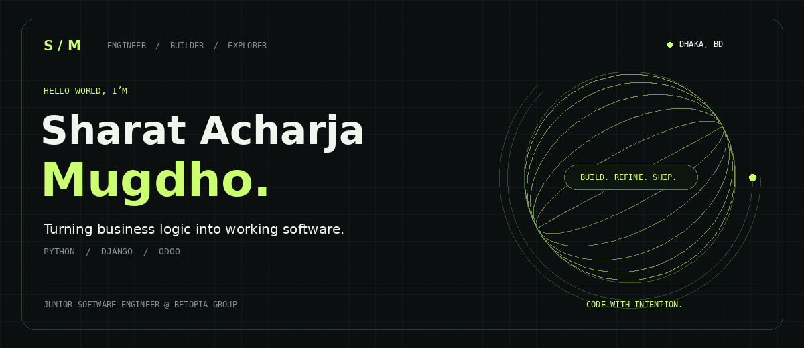
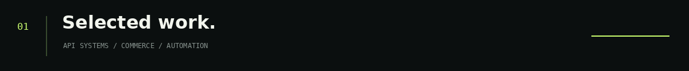
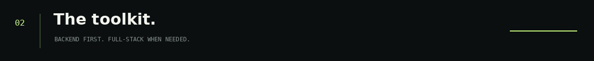
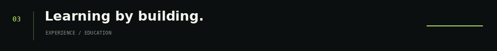
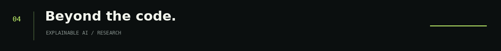

 

**Backend engineering · ERP customization · Real-world applications**

  

[About](#about) &nbsp; / &nbsp; [Selected work](#projects) &nbsp; / &nbsp; [Toolkit](#tech-stack) &nbsp; / &nbsp; [Journey](#experience) &nbsp; / &nbsp; [Research](#research) &nbsp; / &nbsp; [Connect](#connect)

 

## Business logic. Thoughtful software.

I'm a software engineer based in Dhaka. At **Betopia Group**, I work on **Odoo 19** modules — writing Python models, updating views, and adapting workflows to how the business operates.

My other projects are mostly built with **Django and Django REST Framework**. They cover food delivery, e-commerce, and order management, with authentication, database work, and background tasks along the way.

I graduated in **Computer Science & Engineering from Green University of Bangladesh** in January 2026. I also worked on research in explainable deep learning for ocular disease classification.

Outside work, I'm into photography, travel, and football. **Real Madrid** is my team. ⚽

 

<table>
<tr>
<td width="50%" valign="top">

<h3>01 / Bite</h3>
<b>Multi-role food delivery platform</b>

A food delivery app with separate roles for customers, vendors, and admins. I built the ordering flow around a Django REST API and a React frontend.

<ul>
<li>Customer, Vendor & Admin roles</li>
<li>JWT authentication & role-based access</li>
<li>Cart, checkout & order management</li>
</ul>

<code>Django</code> <code>DRF</code> <code>React</code> <code>PostgreSQL</code> <code>Tailwind CSS</code>

<a href="https://github.com/Sharatpsd/Food-Delivery-App-"><b>View code ↗</b></a>
&nbsp;·&nbsp;
<a href="https://bite-bd.onrender.com/"><b>Live demo ↗</b></a>

</td>
<td width="50%" valign="top">

<h3>02 / Daily Dairy Shop</h3>
<b>Dairy shop e-commerce app</b>

A Django shop for managing products, stock, carts, and orders. I used Cloudinary for media storage and Docker for deployment.

<ul>
<li>Product & inventory management</li>
<li>Shopping cart & order processing</li>
<li>Cloudinary media & GitHub Actions CI/CD</li>
</ul>

<code>Django</code> <code>PostgreSQL</code> <code>Docker</code> <code>Cloudinary</code> <code>GitHub Actions</code>

<a href="https://github.com/Sharatpsd/DailyDairyShop"><b>View code ↗</b></a>
&nbsp;·&nbsp;
<a href="https://dailydairyshop-3.onrender.com/"><b>Live demo ↗</b></a>

</td>
</tr>
<tr>
<td colspan="2" valign="top">

<h3>03 / Chai Order System</h3>
<b>Chai ordering & background tasks</b>

An order management project where I worked with dynamic pricing, Redis caching, and Celery to run tasks in the background.

Celery background tasks &nbsp;·&nbsp; Redis caching &nbsp;·&nbsp; Dynamic pricing

<code>Django</code> <code>Redis</code> <code>Celery</code> <code>SQLite</code> <code>Docker</code>

<a href="https://github.com/Sharatpsd/chai-order-system"><b>View code ↗</b></a>
&nbsp;·&nbsp;
<a href="https://chai-order-system-5.onrender.com/"><b>Live demo ↗</b></a>

</td>
</tr>
</table>

<a href="https://sharatpsd.netlify.app/"><b>More on my portfolio →</b></a>

 

**Backend & ERP**

**Databases & deployment**

**Frontend & tooling**

<b>Other tools and technologies</b>

 

| Area | Technologies & practices |
| :--- | :--- |
| **Backend & APIs** | Python, Django, Django REST Framework, Celery, REST APIs, JWT, RBAC |
| **Enterprise ERP** | Odoo 19, Odoo ORM, XML Views, OWL, Actions & Menus, Access Rights, Record Rules |
| **Data & caching** | PostgreSQL, Redis, MySQL, SQLite |
| **Frontend** | React, TypeScript, JavaScript, Tailwind CSS, Vite |
| **Delivery & hosting** | Docker, Linux, GitHub Actions, Render, Vercel, Netlify, Cloudinary |
| **Developer tools** | Git, VS Code, Postman, Swagger |
| **AI & research** | PyTorch, scikit-learn, Pandas, ResNet50, Grad-CAM, SHAP |

 

### Junior Software Engineer
**Betopia Group · Dhaka** · Current

I develop and customize **Odoo 19** modules for business workflows. My work includes:

- Python models, Odoo ORM, and XML views.
- Access rights, record rules, actions, and menus.
- PostgreSQL operations and debugging with Linux and Git.

### Backend Developer Intern
**Robo Tech Valley · Dhaka**  
2025

I worked on Django REST Framework APIs, JWT authentication and refresh tokens, and role-based access. I also helped with query optimization and connecting the APIs to the frontend.

[View internship certificate ↗](https://drive.google.com/file/d/1Jw82jFGXPvliJHYxBPOUh6oIlpm-j8mE/view)

### B.Sc. in Computer Science & Engineering
**Green University of Bangladesh**  
Graduated January 2026

 

### Explainable Deep Learning for Multi-Disease Ocular Classification and Severity-Aware Myopia Analysis

My **IEEE-published research** explores retinal disease classification with ResNet50 and uses Grad-CAM and SHAP to help explain the predictions.

[Read the research paper →](https://drive.google.com/file/d/1XVzO6kOMtIVtVqfTo52M3sQzBVn16Mk2/view)

 

## Next on the horizon

I’m spending more time on **PostgreSQL, system design, and Odoo’s OWL framework**. FastAPI, Redis patterns, Celery, and cloud deployment are also on my learning list.

<b>GitHub activity</b>

 

[View my contributions on GitHub →](https://github.com/Sharatpsd?tab=overview)

 

---

## Let’s build something useful.

You can find my projects on my portfolio, or reach me on LinkedIn and email.

**[sharatacharjee6@gmail.com](mailto:sharatacharjee6@gmail.com)**

  

📍 **Dhaka, Bangladesh**

